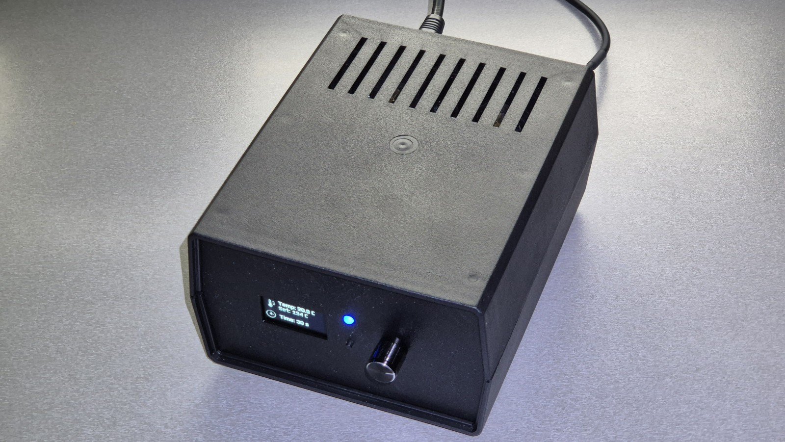
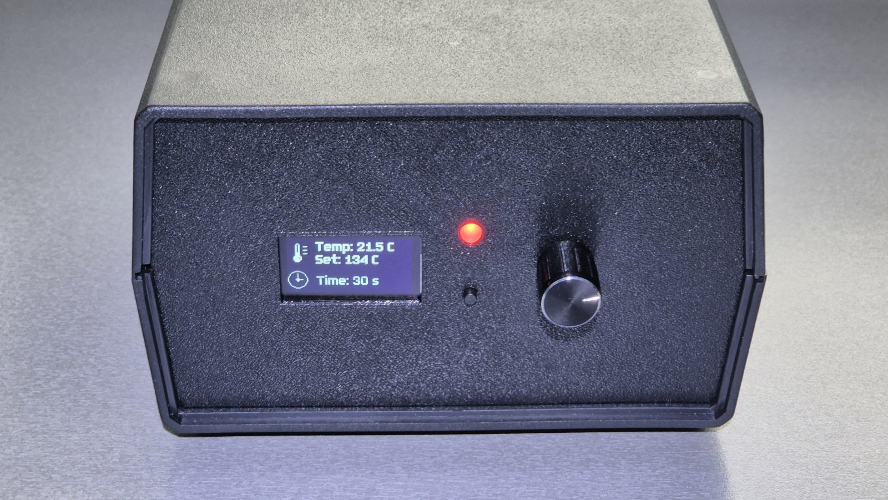
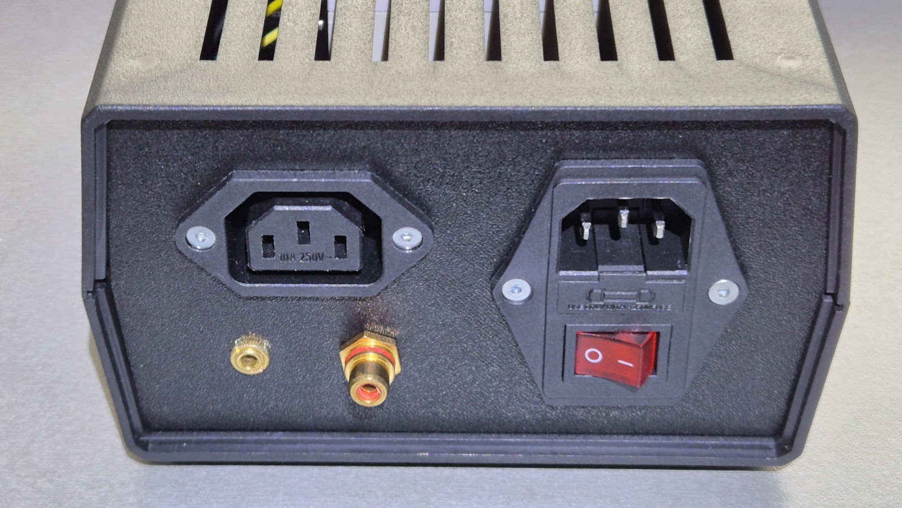
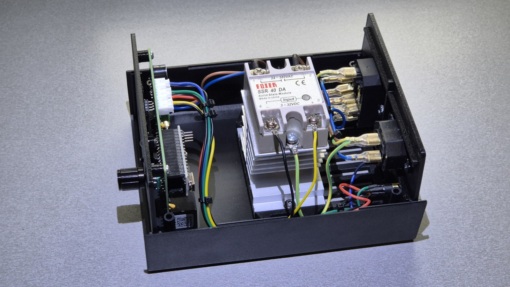

# 3D Models and Enclosure

This folder contains the enclosure design and photos for the Oblátkovač electronics. The electronics fit into a [Z2AW enclosure](https://www.kradex.com.pl/product/enclosures_with_side_panels/z2a?lang=en), front and back panels (faces) are 3D-printed to match the PCB layout and connectors.

## Design source

- Original design created in SketchUp (file: `design.skp`).
- The provided SketchUp file is the editable source for the printed front/back panels and mounting features.

## Included files

- `design.skp` — SketchUp source project for the enclosure panels and mounting features.
- `front_pannel.stl` — Front panel with integrated mounting features for the PCB.
- `back_pannel.stl` — Back panel with cutouts and mounting openings for connectors.
- `heatsink_holder.stl` — Mounting bracket for the SSR (solid-state relay) heat sink.
- `oled_support.stl` — Support/bracket for the OLED display module.

## Printing & export notes

- Print the front and back panels in PETG (recommended) or ABS. PETG is easier to print and more dimensionally stable; ABS offers higher temperature resistance but may require an enclosed printer and additional post-processing.
- Typical print settings: 0.2 mm layer height, 15–30% infill, 2–4 perimeters. Use supports where needed for overhangs.
- Export to STL from SketchUp (SketchUp Pro or STL export plugin). Ensure model units are millimetres and scale is 1:1 before exporting.
- Check fit against the PCB and fasteners; consider printing a small test-fit section before full prints.

## Assembly

- Attach the assembled PCB to the front panel using the integrated mounting bosses.
- Install and secure all connectors into the back panel cutouts.
- Attach the SSR heat sink to its bracket and fasten securely.
- Complete wiring between the PCB, connectors and power components, following the schematic and safety guidelines.

## Final product

## License

See the repository `LICENSE` at the project root for licensing terms.
