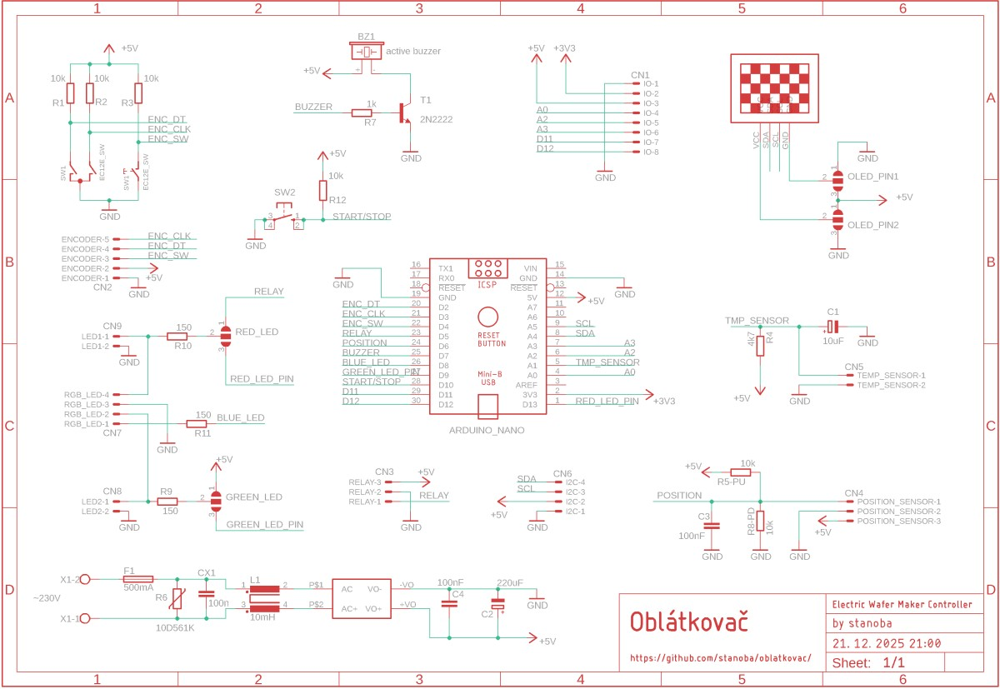
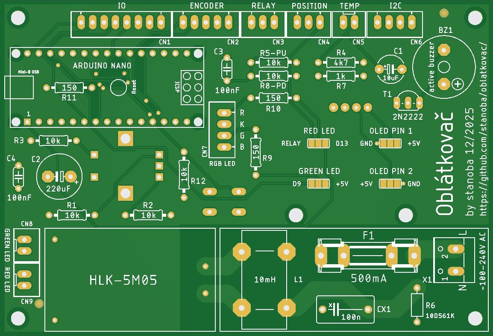

# Oblátkovač PCB (Work in progress)

PCB for Oblátkovač (Electric Wafer Maker Controller).

## Schematic

## PCB

## Eagle libraries

Downloaded from:

- ArduinoNanoV30.lbr
    - https://github.com/psrobotics/eagle_lib
- Rembrandt Electronics - JST XH Connectors v1-0.lbr
    - https://github.com/yann-ygn/eagle-libraries/blob/master/Rembrandt%20Electronics%20-%20JST%20XH%20Connectors%20v1-0.lbr
    - https://www.diymodules.org/eagle-show-object?type=usr&id=1012211612&part=Rembrandt+Electronics+-+JST+XH+Connectors+v1-0.lbr&device=JST-XH-02-PIN
- 13oled.lbr
	- https://github.com/suhail-jr/1.3-OLED-Display-Module-Eagle-Library/
- mastrogippo.lbr
	- https://github.com/mastrogippo/MastroGippo-Eagle-library
