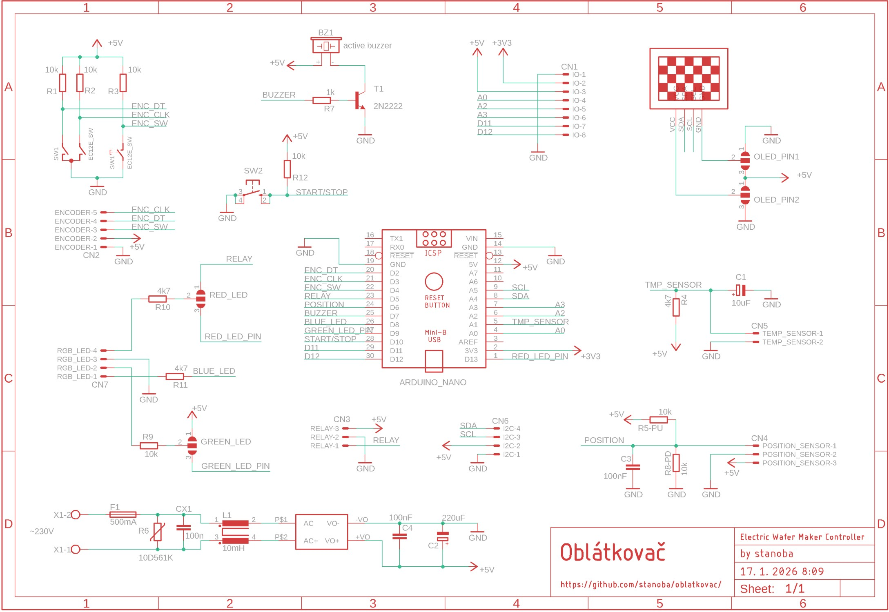
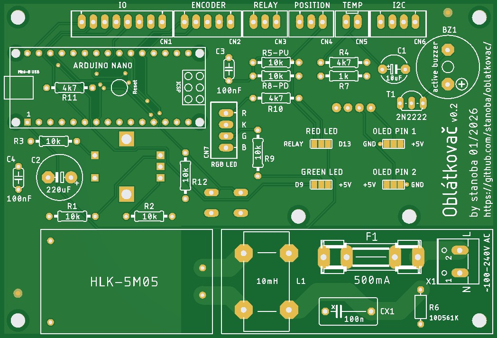
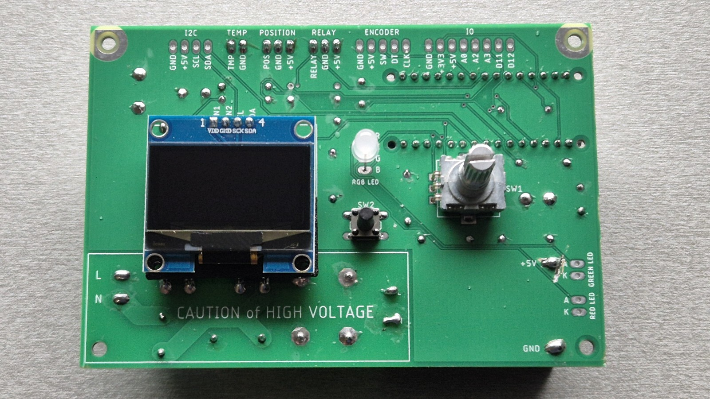
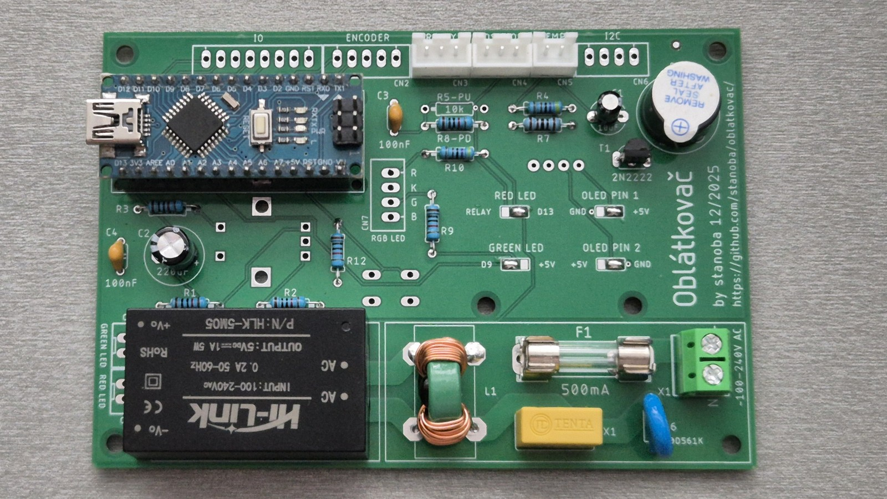

# Oblátkovač PCB (Work in progress)

The PCB for Oblátkovač (Electric Wafer Maker Controller) and schematic were designed using Autodesk EAGLE. Source EAGLE project files (schematic and board) are included in this folder.

- **Gerbers:** Manufacturing Gerber files are available in the [Hardware/gerber files/](Hardware/gerber%20files/) directory for PCB fabrication.
- **Libraries:** The EAGLE libraries used in the design are included in the [Hardware/libraries/](Hardware/libraries/) folder.
- **Notes:** Open the .sch and .brd files in Autodesk EAGLE. To regenerate Gerbers, use EAGLE's CAM processor and export an RS-274X Gerber set.
  

Eagle libraries Downloaded from:

- ArduinoNanoV30.lbr
    - https://github.com/psrobotics/eagle_lib
- Rembrandt Electronics - JST XH Connectors v1-0.lbr
    - https://github.com/yann-ygn/eagle-libraries/blob/master/Rembrandt%20Electronics%20-%20JST%20XH%20Connectors%20v1-0.lbr
    - https://www.diymodules.org/eagle-show-object?type=usr&id=1012211612&part=Rembrandt+Electronics+-+JST+XH+Connectors+v1-0.lbr&device=JST-XH-02-PIN
- 13oled.lbr
	- https://github.com/suhail-jr/1.3-OLED-Display-Module-Eagle-Library/
- mastrogippo.lbr
    - https://github.com/mastrogippo/MastroGippo-Eagle-library

## Schematic

## PCB

Front side: 

Back side: 

## Safety

**Warning:** this project involves mains and high-voltage circuitry. Working on or near high voltage can cause serious injury or death.

- **Disconnect power:** Always remove mains power and verify the circuit is de-energized before touching components.
- **Use PPE:** Wear appropriate personal protective equipment (insulating gloves, eye protection) when testing live systems.
- **Isolation:** Keep a safe distance from exposed conductors; use insulated tools and work on insulated surfaces.
- **Discharge capacitors:** Safely discharge capacitors before servicing; they can hold lethal charge after power removal.
- **One hand rule:** When possible, use the one-hand rule to avoid current passing through the chest.
- **Qualified personnel:** If you are not experienced with mains/high-voltage electronics, seek assistance from a qualified technician or electrician.
- **Work sober and focused:** Never work on high-voltage circuits when tired, impaired, or alone.

Follow local regulations and best practices for electrical safety. The authors are not responsible for damage or injury from misuse.
